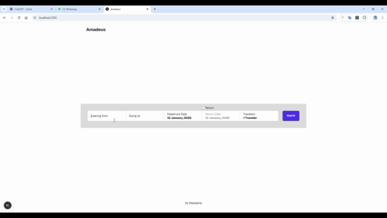
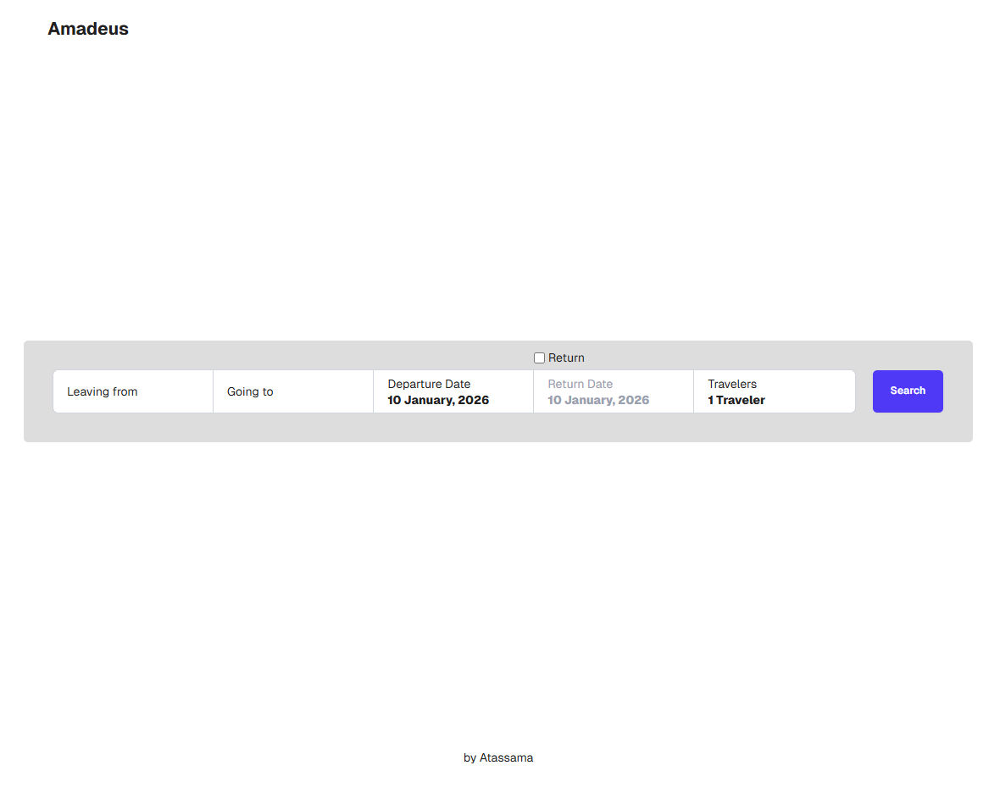
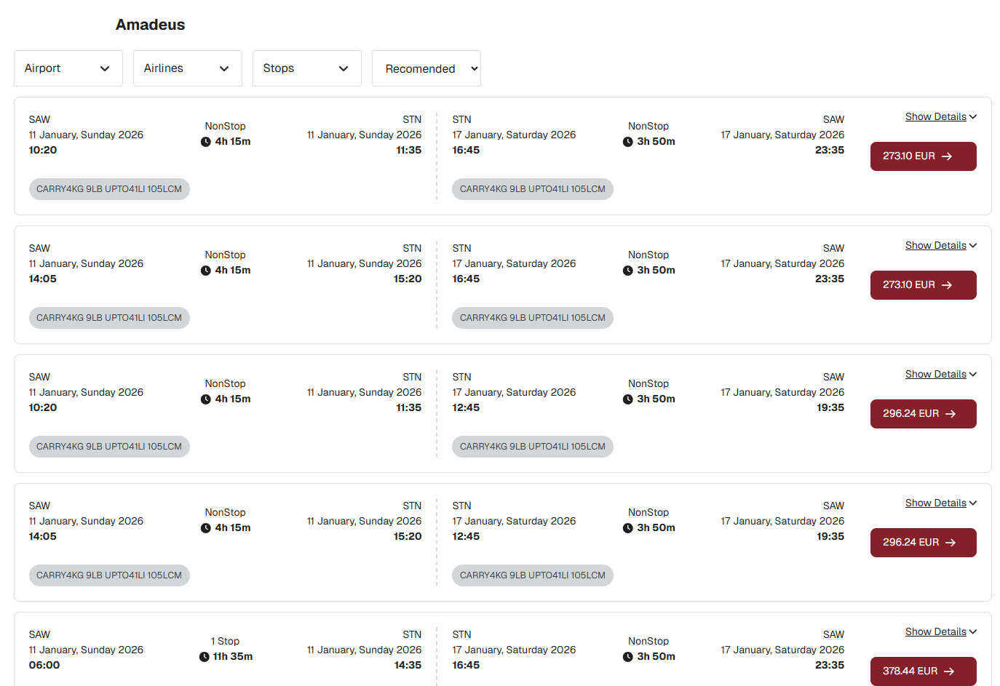
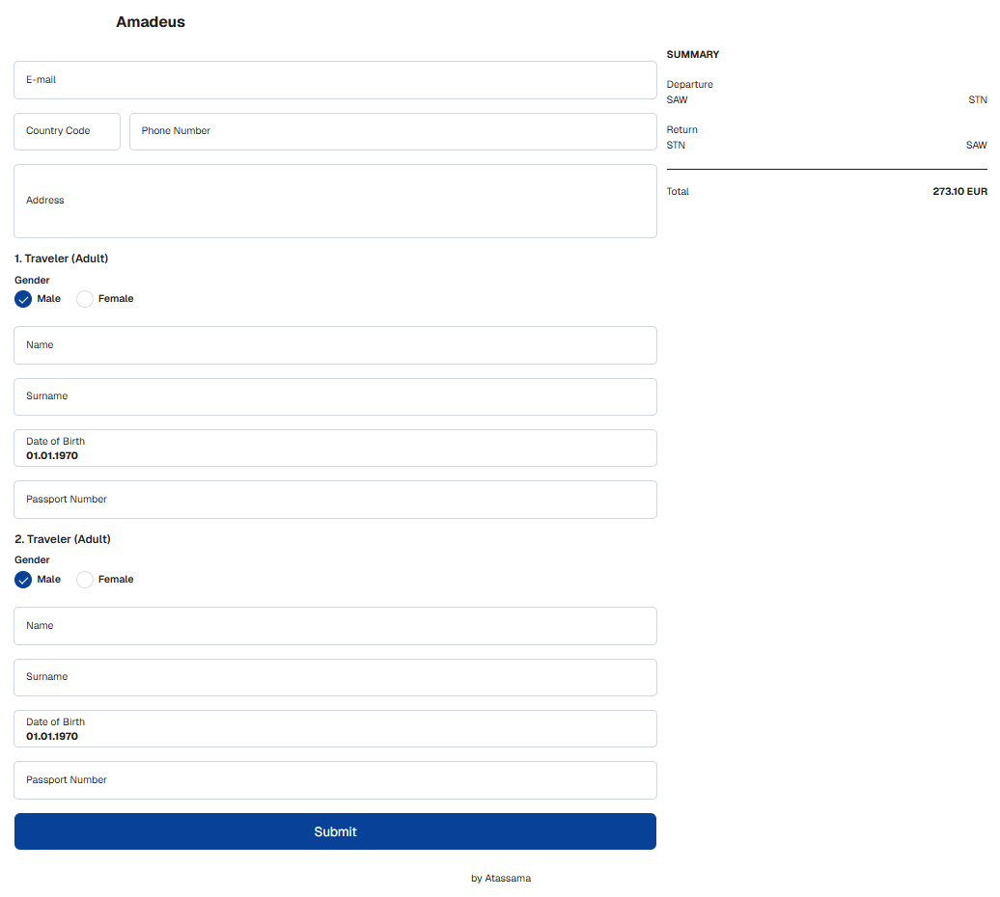

# ✈️ Amadeus Flight Booking Demo (Next.js)

A modern flight search & booking flow demo built with **Amadeus APIs**.  
Flow: **Search → Results → Filters → Flight Selection → Booking → Confirmation**

> **Disclaimer:** This project is not affiliated with or endorsed by Amadeus.

---

## 🎬 Demo (Full Flow)



---

## 🖼️ Screenshots

<p align="center">
  
  
</p>

<p align="center">
  
</p>

---

## 🧭 App Flow & Routes

1) **Home / Search**
- `/`

2) **Flight Results**
- `/flights`

Example:
- `/flights?originLocationCode=IST&destinationLocationCode=LON&departureDate=2026-01-11&adults=2&max=250&returnDate=2026-01-17`

**Query Params**
- `originLocationCode` — IATA city/airport code (e.g., `IST`)
- `destinationLocationCode` — IATA city/airport code (e.g., `LON`)
- `departureDate` — `YYYY-MM-DD`
- `returnDate` — `YYYY-MM-DD` *(optional for one-way)*
- `adults` — passenger count
- `max` — maximum number of flight offers to fetch/return

3) **Booking / Traveler Details**
- `/booking`

4) **Confirmation**
- `/confirmation/:id`

Example:
- `/confirmation/eJzTd9c3NzeK9DECAAorAh0`

---

## ✨ Features

- End-to-end booking flow (search → list → filters → booking → confirmation)
- URL-based search parameters (shareable results page)
- Sorting & filtering support on flight list
- Traveler details form with validation
- Component-driven development with Storybook
- Type-safe development with TypeScript

---

## 🧰 Tech Stack

### Core
- **Next.js** `15.4.6`
- **React** `19.1.0`
- **TypeScript** (via `@types/*`)

### Styling & UI
- **Tailwind CSS** `4.1.12`
- **Sass (SCSS Modules)** `1.90.0`
- **classnames** `2.5.1`
- **Font Awesome**
  - `@fortawesome/fontawesome-svg-core` `7.0.0`
  - `@fortawesome/free-solid-svg-icons` `7.0.0`
  - `@fortawesome/react-fontawesome` `3.0.0`

### Forms & Validation
- **React Hook Form** `7.66.0`
- **Yup** `1.7.1`
- **@hookform/resolvers** `5.2.2`

### Dates & Time
- **moment** `2.30.1`
- **moment-duration-format** `2.3.2`
- **react-datepicker** `8.7.0`

### HTTP & Utilities
- **axios** `1.11.0`
- **qs** `6.14.0`
- **lodash** `4.17.21`
- **slugify** `1.6.6`

### Inputs
- **react-imask** `7.6.1`
- **react-phone-input-2** `2.15.1`

### Cookies
- **cookie** `1.0.2`
- **js-cookie** `3.0.5`

---

## 🛠️ Tooling

### Storybook
- **storybook** `10.1.4`
- **@storybook/nextjs-vite** `10.1.4`
- Addons:
  - `@storybook/addon-a11y` `10.1.4`
  - `@storybook/addon-docs` `10.1.4`
  - `@storybook/addon-onboarding` `10.1.4`
  - `@storybook/addon-vitest` `10.1.4`
- **Chromatic** `4.1.3`

### Linting
- **ESLint** `^9`
- **eslint-config-next** `15.4.6`
- **eslint-plugin-storybook** `10.1.4`

### Testing
- **Vitest** `4.0.15`
- **Playwright** `1.57.0`
- `@vitest/browser-playwright` `4.0.15`
- `@vitest/coverage-v8` `4.0.15`

### Build Tooling
- **Vite** `7.2.6`
- `@tailwindcss/postcss` `4`

---

## 🚀 Getting Started

### 1) Install

```bash
npm install
# or
yarn
# or
pnpm install
```

### 2) Environment Variables

Create a `.env.local` file:

```env
CLIENT_ID=YOUR_ID
CLIENT_SECRET=YOUR_SECRET
AMADEUS_ENVIRONMENT=test
```

> Do **not** commit `.env.local`.

### 3) Run

```bash
npm run dev
```

App runs at `http://localhost:3000`

---

## 📚 Storybook

```bash
npm run storybook
```

Build:

```bash
npm run build-storybook
```
